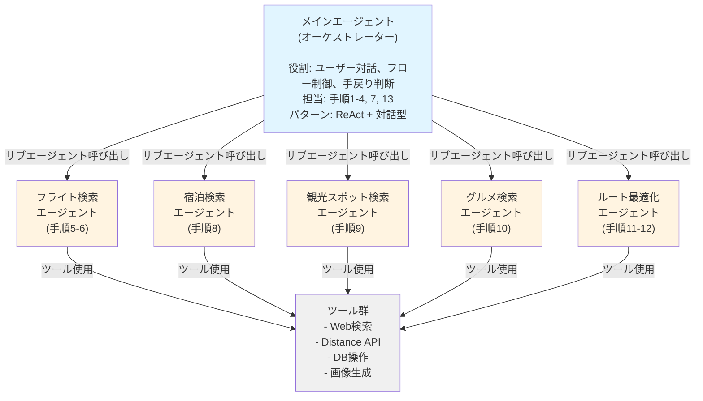
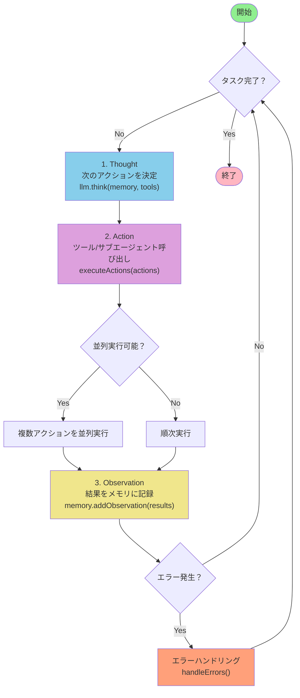

# AIエージェントアーキテクチャ

## 全体構成

マルチエージェントシステム：メインエージェント（オーケストレーター）が5つのサブエージェントを調整。



## 設計パターン

### ハイブリッド型エージェント

**固定フロー部分**:
- 手順1-8: 大枠の決定（順序が重要）
- 各ステップで必要な情報が揃ったら次へ

**動的（ReAct）部分**:
- 手順9-13: 詳細充填と調整
- 状況に応じて柔軟に行動を決定
- ツールの動的な呼び出し
- 手戻りの判断

## メインエージェント

### 責務
1. **ユーザーとの対話** - 情報を段階的に引き出す
2. **状態管理** - 決定事項を記憶
3. **サブエージェント呼び出し** - 適切なタイミングで専門エージェントに委譲
4. **検証と調整** - スケジュールの妥当性チェックと手戻り判断

### 担当する手順

**手順1: 目的の明確化**
- ユーザー入力を解析
- 目的を抽出

**手順2: 旅先の決定**
- 目的から旅先を決定
- ユーザーに確認

**手順3: 時期の決定**
- 気候、価格を考慮
- 推奨時期を提案

**手順4: 期間の決定**
- 目的地に適した期間を推定
- LLM推論

**手順7: 日別コンセプトの決定**
- 各日のエリアとテーマを決定
- LLM推論

**手順13: 検証と調整判断**
- スケジュールの妥当性をチェック
- 調整が必要な場合、どのステップに戻るか判断
- ユーザーに調整案を提示

### 動作方式

**ReActループ**:



疑似コード:
```javascript
while (!isTaskComplete(memory)) {
  // 1. Thought: 次のアクションを決定
  thought = llm.think(memory, tools);

  // 2. Action: ツール/サブエージェント呼び出し
  actions = parseActions(thought);
  results = await executeActions(actions, { parallel: true });

  // 3. Observation: 結果をメモリに記録
  memory.addObservation(results);

  // エラーハンドリング
  if (hasErrors(results)) {
    handleErrors(results, memory);
  }
}
```

### 対話スタイル

**自然な会話形式**（パターンB）:
```
ユーザー: "上海ディズニーに行きたい"
メイン: "いいですね！いつ頃、何日間を考えていますか？出発地はどこですか？"
ユーザー: "1月に3泊4日で、東京から"
メイン: （分析）全情報揃った → フライト検索に進む
```

- 柔軟で自然
- LLMが必要情報の有無を判断
- 不足情報を自然に引き出す

### サブエージェント呼び出しタイミング

**即座に呼び出し**（パターンA）:
```
ユーザー: "1月に3泊4日"
メイン: （フライト検索エージェントを呼び出し中...）
メイン: "以下のフライトが見つかりました：..."
```

- レスポンスが早い
- ユーザーが待たされない

### エラーハンドリング

**別日程を自動提案**（パターンB）:
```
フライト検索エラー → 自動で別日程を試す → ユーザーに提案

例:
メイン: "1/17-20のフライトは満席でしたが、以下の日程が空いています：
1. 1/20-23, JAL, ¥38,000
2. 1/24-27, ANA, ¥32,000
どちらかでいかがですか？"
```

### 並列処理

可能な場面では並列実行:
```javascript
// Day 1の観光とグルメを並列で検索
await Promise.all([
  call_spot_search({ day: 1, area: "外灘" }),
  call_gourmet_search({ day: 1, area: "外灘" })
])
```

## サブエージェント

### 1. フライト検索エージェント（手順5-6）

**役割**: 具体的なフライトを提案

**入力**:
```json
{
  "origin": "東京",
  "destination": "上海",
  "month": "1月",
  "duration": "3泊4日",
  "budget": "中程度"
}
```

**処理**:
1. フライト情報をWeb検索
2. 価格帯でフィルタリング
3. 利便性の評価（直行便、時間帯）
4. 複数候補を提示

**出力**:
```json
{
  "options": [
    {
      "dates": "1/17-20",
      "outbound": "羽田 10:00 → 上海浦東 12:30",
      "return": "上海浦東 14:00 → 羽田 18:00",
      "price": "¥35,000",
      "airline": "ANA"
    }
  ]
}
```

**ツール**:
- Web検索（フライト比較サイト）
- 価格比較ロジック

---

### 2. 宿泊検索エージェント（手順8）

**役割**: ホテルを提案

**入力**:
```json
{
  "destination": "上海",
  "dates": "1/17-20",
  "daily_plan": {
    "day1": "外灘",
    "day2": "豫園",
    "day3": "ディズニー",
    "day4": "外灘"
  },
  "budget": "中程度"
}
```

**処理**:
1. エリア決定（日別プランから最適な拠点を判断）
2. ホテル検索（Web検索）
3. レビュー分析
4. アクセス評価

**出力**:
```json
{
  "hotel": {
    "name": "上海外灘ホテル",
    "area": "外灘",
    "price_per_night": "¥15,000",
    "rating": 4.5,
    "access": {
      "to_bund": "徒歩5分",
      "to_yuyuan": "地下鉄20分",
      "to_disney": "地下鉄60分"
    }
  }
}
```

**ツール**:
- Web検索
- レビュー分析ロジック
- Google Distance Matrix API

---

### 3. 観光スポット検索エージェント（手順9）

**役割**: 各日の観光スポットをリストアップ

**入力**:
```json
{
  "day": 2,
  "area": "豫園",
  "theme": "文化体験",
  "duration": "8時間"
}
```

**処理**:
1. エリアのスポット検索
2. テーマに合致度評価
3. 所要時間調査
4. 営業時間確認
5. 優先度付け

**出力**:
```json
{
  "spots": [
    {
      "name": "豫園",
      "category": "庭園",
      "duration_minutes": 90,
      "rating": 4.7,
      "opening_hours": "8:30-17:30",
      "price": "¥40",
      "latitude": 31.2276,
      "longitude": 121.4920,
      "priority": "high"
    }
  ]
}
```

**ツール**:
- Web検索
- レビュー分析

---

### 4. グルメ検索エージェント（手順10）

**役割**: 各食事のレストランを提案

**入力**:
```json
{
  "day": 2,
  "area": "豫園",
  "meal_type": "lunch",
  "cuisine_preference": "上海料理",
  "budget": "中程度"
}
```

**処理**:
1. エリア×食事時間でレストラン検索
2. 「地元おすすめ」を優先
3. レビュー分析
4. 価格帯フィルタ

**出力**:
```json
{
  "restaurants": [
    {
      "name": "南翔饅頭店",
      "cuisine": "小籠包",
      "rating": 4.6,
      "price_range": "¥1,500-3,000",
      "latitude": 31.2280,
      "longitude": 121.4925,
      "speciality": "上海名物小籠包"
    }
  ]
}
```

**ツール**:
- Web検索
- レビュー分析

---

### 5. ルート・スケジュール最適化エージェント（手順11-12）

**役割**: スポット順序の最適化と詳細タイムライン生成

**入力**:
```json
{
  "day": 2,
  "hotel": {...},
  "spots": [...],
  "restaurants": [...]
}
```

**処理**:
1. 全スポットの座標取得
2. 移動時間計算（Google Distance Matrix API）
3. 訪問順序最適化（TSP問題）
   - 営業時間制約を考慮
   - 食事時間を適切に配置
4. 詳細タイムライン生成
   - 移動時間を含む
   - バッファ時間を追加

**出力**:
```json
{
  "schedule": {
    "activities": [
      {
        "start_time": "09:00",
        "end_time": "10:30",
        "activity_type": "sightseeing",
        "name": "豫園",
        "latitude": 31.2276,
        "longitude": 121.4920
      },
      {
        "start_time": "10:30",
        "end_time": "10:45",
        "activity_type": "transport",
        "name": "移動（徒歩）"
      },
      {
        "start_time": "12:00",
        "end_time": "13:00",
        "activity_type": "meal",
        "name": "南翔饅頭店"
      }
    ],
    "total_duration_hours": 8.5
  },
  "status": "ok"
}
```

**ツール**:
- Google Distance Matrix API
- TSP最適化アルゴリズム

---

## ツール群

各エージェントから呼び出される共通ツール。

### 1. Web検索ツール

**機能**:
- 検索クエリの最適化
- 複数サイトからの情報統合
- 最新情報の取得
- 構造化データ抽出

**実装候補**:
- Perplexity API
- Tavily
- Google Search API
- 自前スクレイピング

### 2. Google Distance Matrix API

**機能**:
- 2地点間の移動時間・距離計算
- 複数の移動手段（徒歩、車、公共交通）

### 3. DB操作ツール

**機能**:
- セッション保存
- メモリ永続化
- プラン保存

### 4. 画像生成ツール

**機能**:
- GPT-5で画像生成
- スポット写真の生成

## ReActパターン

参照: https://huggingface.co/docs/smolagents/conceptual_guides/react

**基本構造**:
```
Thought（推論）→ Action（行動）→ Observation（観察）→ 繰り返し
```

**Mastraでの実装**:
- **CodeAgent**: Pythonコードスニペットとしてツール呼び出し
- **ToolCallingAgent**: JSONとしてツール呼び出し

詳細は [メインエージェントフロー](./main-agent-flow.md) を参照。

## 関連ドキュメント

- [プロジェクト概要](./overview.md)
- [ユーザージャーニー](./user-journey.md)
- [メインエージェントフロー](./main-agent-flow.md)
- [サブエージェント仕様](./subagent-specifications.md)
